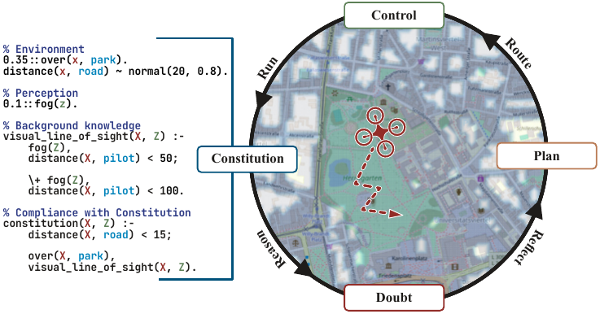

# CoCo — The Constitutional Controller

[](https://arxiv.org/abs/2507.15478)
[](https://pypi.org/project/python-coco/)
[](LICENSE)
[](https://www.python.org/)

**Doubt-Calibrated Steering of Compliant Agents**

---

<p align="center">
  
</p>

CoCo couples low-level motion control with probabilistic logic by learning a **self-doubt density**, a Conditional Normalizing Flow that models an agent's control inaccuracies as a function of its operating conditions (e.g. velocity, heading). 
This doubt distribution is folded into a [ProMis](https://github.com/HRI-EU/ProMis) compliance landscape at query time, producing a *doubt-calibrated* landscape that accounts for where the agent will actually end up, not just where it intends to go.
Paths can then be evaluated or steered to remain constitutionally compliant even under uncertainty.

## Installation

```bash
pip install python-coco
```

To install from source:

```bash
git clone https://github.com/simon-kohaut/CoCo
cd CoCo
pip install -e .
```

## Quick Start

### 1. Train a doubt density

```python
import numpy as np
from coco import DoubtDensity

# Define the doubt space: features that condition the agent's inaccuracies
doubt_space = {
    "velocity": {
        "type": "continuous",
        "values": np.array([...]),   # shape (N,) — one value per training sample
    }
}

# Observed control errors (shape N x 2)
samples = np.array([...])

density = DoubtDensity(
    doubt_space=doubt_space,
    number_of_states=2,
    number_of_hidden_features=32,
    number_of_layers=4,
)
losses = density.fit(samples, doubt_space, number_of_epochs=100, batch_size=64)

density.save("doubt_density.pkl")
```

### 2. Apply doubt to a compliance landscape

```python
from coco import ConstitutionalController, DoubtDensity
from promis import ProMis, StaRMap

density = DoubtDensity.load("doubt_density.pkl")

# doubt_space at inference time (query conditions)
query_doubt_space = {
    "velocity": {"type": "continuous", "values": np.array([target_speed])}
}

# landscape is a ProMis CartesianCollection with compliance values
controller = ConstitutionalController()
doubtful_landscape = controller.apply_doubt(
    landscape=landscape,
    doubt_density=density,
    doubt_space=query_doubt_space,
    number_of_samples=500,
)
```

### 3. Evaluate path compliance

```python
# path: np.ndarray of shape (T, 2)
compliance_scores = controller.compliance(
    path=path,
    landscape=landscape,
    doubt_density=density,
    doubt_space=query_doubt_space,
    number_of_samples=500,
)
# compliance_scores: (T,) array in [0, 1]
```

## Citation

```bibtex
@inproceedings{kohaut2026coco,
  title     = {The Constitutional Controller: Doubt-Calibrated Steering of Compliant Agents},
  author    = {Kohaut, Simon and Divo, Felix and Hamid, Navid and Flade, Benedict
               and Eggert, Julian and Dhami, Devendra Singh and Kersting, Kristian},
  booktitle = {Proceedings of the IEEE/RSJ International Conference on Intelligent
               Robots and Systems (IROS)},
  year      = {2026}
}
```
